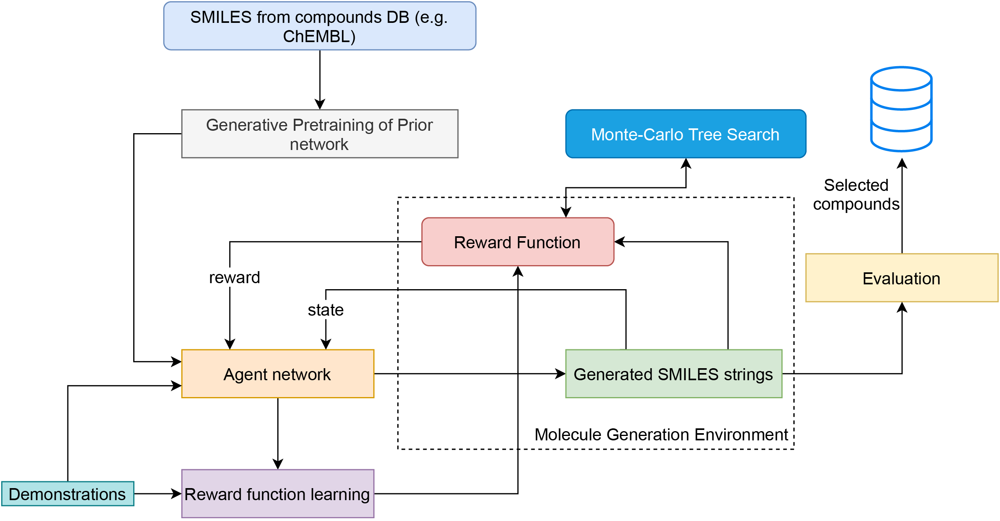

# IReLeaSE
This repository contains the source codes of the 
[Deep Inverse Reinforcement Learning for Structural Evolution of Small Molecules](https://arxiv.org/abs/2008.11804)
paper. The work proposes a framework for training compound generators using 
Deep Inverse Reinforcement Learning.



## Requirements
### Dependencies

|Library/Project | Version     |
|----------------|-------------|
| [pytorch](https://pytorch.org/get-started/locally/)          | 1.3.0       |
|[numpy](https://pypi.org/project/numpy/) | 1.18.4|
|[ptan](https://github.com/Shmuma/ptan) | 0.6|
| [tqdm](https://github.com/tqdm/tqdm)                         | 4.35.0      |
|[scikit-learn](https://scikit-learn.org/stable/install.html)|0.23.1
|[joblib](https://pypi.org/project/joblib/)|0.13.2|
| [soek](https://github.com/bbrighttaer/soek)                  | 0.0.1       |
|[pandas](https://pypi.org/project/pandas/)|1.0.3|
|[xgboost](https://pypi.org/project/xgboost/)|0.90|
| [rdkit](https://anaconda.org/rdkit/rdkit)                    | 2019.09.3.0 |
|[gym](https://github.com/openai/gym)|0.15.6|

To install the dependencies, we suggest you install 
[Anaconda](https://www.anaconda.com/products/individual) 
first and then follow the commands below:

1. Create anaconda environment
    ```bash
    $ conda create -n irelease python=3.7
    ```
2. Activate environment
   ```bash
   $ conda activate irelease
   ```
3. Install the dependencies above according to their official websites or documentations.
For instance, you can install `XGBoost` using the command
   ```bash
   $ pip install xgboost==0.90
   ```

## Datasets
The demonstrations dataset used in the experiments are as follows:

|Experiment|Dataset|
|----------|--------| 
|DRD2 Activity|[drd2_active_filtered.smi](./data/drd2_active_filtered.smi)|
|LogP       | [logp_smiles_biased.smi](./data/logp_smiles_biased.smi)|
|JAK2 Max |[jak2_max_smiles_biased.smi](./data/jak2_max_smiles_biased.smi)|
|JAK2 Min |[jak2_min_smiles_biased.smi](./data/jak2_min_smiles_biased.smi)|

The datasets used for training the models used as evaluation functions are:

|Experiment|Dataset|
|----------|--------| 
|DRD2 Activity|[drd2_bin_balanced.csv](./data/drd2_bin_balanced.csv)|
|LogP       | [logP_labels.csv](./data/logP_labels.csv)|
|JAK2 Max and Min |[jak2_data.csv](./data/jak2_data.csv)|

Pretraining dataset: [chembl.smi](./data/chembl.smi)

## Usage
Install the project as a standard python package from the project directory:
```bash
$ pip install -e .
```

Then `cd` into the `proj` directory:
```bash
$ cd proj/
```

### Pretraining
The Stack-RNN model used in our work could be pretrained with the following command:
```bash
$ cd proj
$ python pretrain_rnn.py --data ../data/chembl.smi
```

### Evaluation Functions


